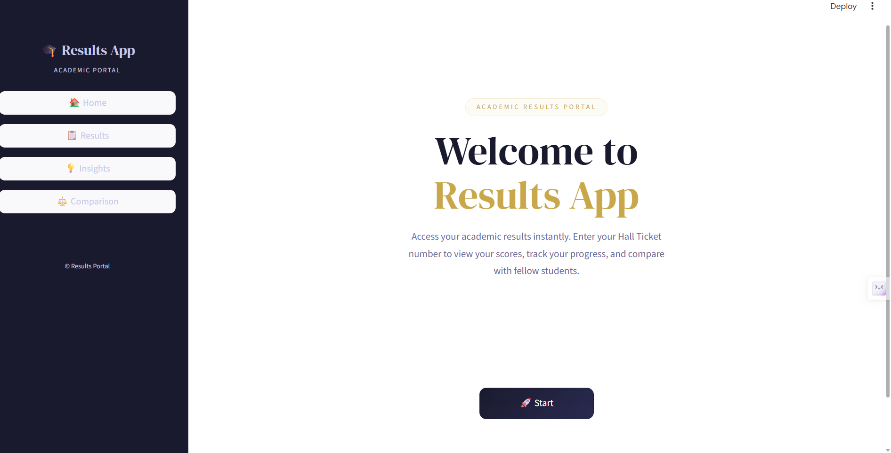
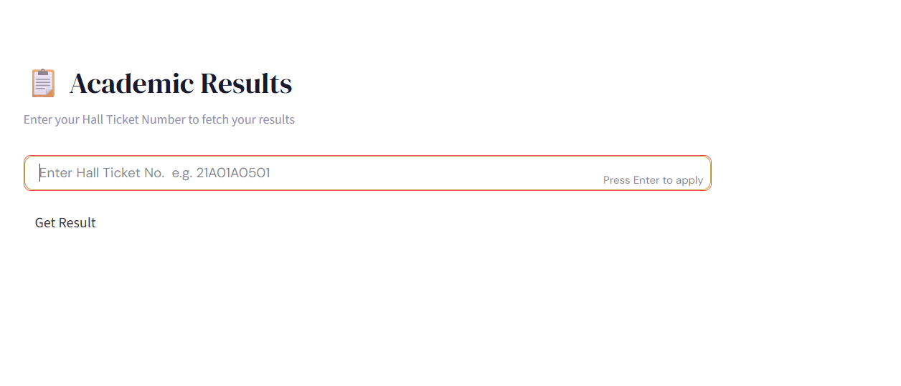
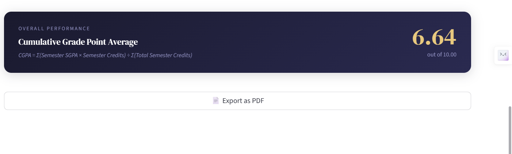
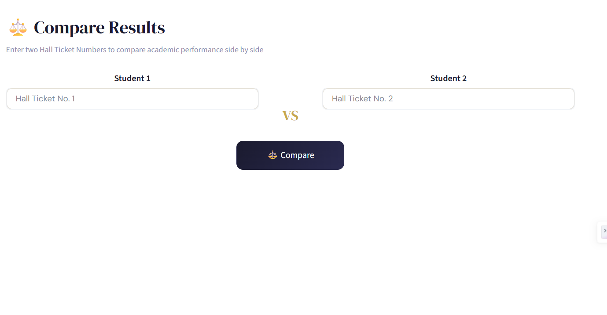

# 🎓 Results App

Results App is an academic analytics portal built with Python and Streamlit. It enables students to view semester-wise academic results, calculate SGPA/CGPA, analyze subject performance, compare results side by side, and export detailed PDF reports through an interactive dashboard.

## 🌐 Live Demo

[https://academic-results.streamlit.app/](https://academic-results.streamlit.app/)

## 📸 Screenshots

### 🏠 Home


### 📋 Results


### 💡 Insights


### 📄 Export PDF


### ⚖️ Comparison


## ✨ Features

- 📋 View semester-wise academic results
- 🎓 Automatic SGPA & CGPA calculation
- 📊 Subject performance visualization
- 📈 SGPA progression across semesters
- 🏆 Best & weakest subject analysis
- ⚖️ Compare two students side by side
- 📄 Export academic report as PDF
- 🎨 Clean and responsive Streamlit interface

## 🚀 Getting Started

### 1. Clone the repo
```bash
git clone https://github.com/PrahitViraajReddy/Results.git
cd Results
```

### 2. Install dependencies
```bash
pip install -r requirements.txt
```

### 3. Add your data
Place your `results.xlsx` file in the project folder.

### 4. Run the app
```bash
streamlit run ui.py
```

## 📁 Project Structure

```text
Results/
├── ui.py                  # Main Streamlit app
├── results.xlsx           # Student results data
├── requirements.txt       # Python dependencies
├── README.md               # Project documentation
└── images/
    ├── home.png
    ├── results.png
    ├── insights.png
    ├── export_pdf.png
    └── comparison.png
```

## 📊 Excel Format

Your `results.xlsx` should contain one sheet per semester (e.g. `Sem 1-1`, `Sem 1-2`, ...) plus a `Summary` sheet. Each semester sheet has one block of columns per subject:

| Column | Description |
|---|---|
| Code | Subject Code |
| Subject Name | Subject Name |
| Int. | Internal Marks |
| Ext. | External Marks |
| Total | Total Marks |
| Grade | Grade (O, A+, A, B+, B, C, F, Ab) |
| Cr. | Subject Credits |

The `Summary` sheet holds `RollNumber`, `Name`, and `Branch` for every student, used to resolve student details across all semesters.

## 🧮 SGPA & CGPA Formula

- **SGPA** = Σ(Grade Point × Credits) ÷ Σ(Credits) — per semester
- **CGPA** = Σ(Semester SGPA × Semester Credits) ÷ Σ(Total Credits) — all semesters

SGPA is only calculated if the student has passed all subjects in that semester (no F or Ab grades). CGPA is only calculated if all semesters are passed. If a student has no record for a semester, it's shown as **"Not Applied for Exams"** instead of being skipped silently.

## 🛠️ Tech Stack

- **Python**
- **Streamlit** — web framework
- **Pandas** — data processing
- **OpenPyXL** — Excel file parsing
- **Plotly** — interactive charts
- **ReportLab** — PDF report generation

## 📖 About

Results App is an academic analytics portal that enables students to access their academic performance, calculate SGPA/CGPA, visualize subject-wise trends, compare results, and export reports through an interactive dashboard.

## 🚀 Future Improvements

- User authentication
- Admin dashboard
- Batch result analysis
- Branch-wise analytics
- Database integration
- Rank prediction

## 📬 Contact

**Made by:** Prahit Viraaj Reddy

- - GitHub: **@PrahitViraajReddy**
- Live App: [https://academic-results.streamlit.app/](https://academic-results.streamlit.app/)

## ⚠️ Disclaimer

This project is intended for educational and personal use. 
